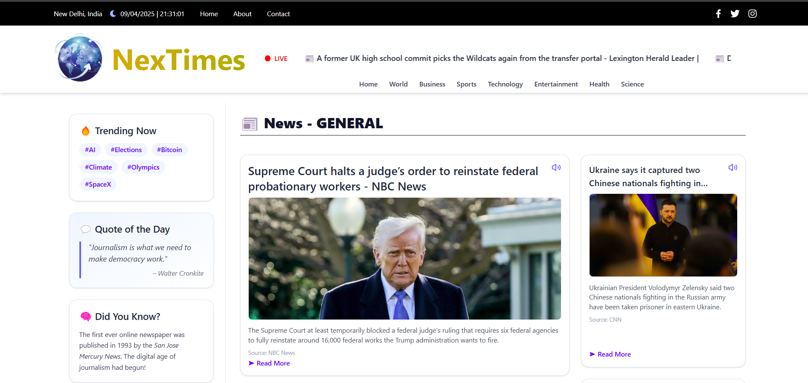

# 🗞️ Nextimes — Beyond Headlines

Nextimes is a modern, responsive news platform that fetches the latest headlines from around the world using the [NewsAPI.org](https://newsapi.org/) service. Designed with performance and user experience in mind, it keeps you updated with top stories across categories like technology, politics, science, sports, and more.

---

## 🚀 Features

- 📰 Live news fetched from **NewsAPI**
- 🔊 Text-to-Speech integration for headline reading
- 📱 Responsive layout for all screen sizes
- 🎯 Trending hashtags, Quote of the Day, and Fun Facts
- ⚡ Load More pagination
- 🛡️ Clean UI with Tailwind CSS
- 🎤 Lucide icons for interactive elements

---

## 🔧 Tech Stack

| Layer       | Technology Used             |
|-------------|-----------------------------|
| Frontend    | React, Tailwind CSS         |
| Backend     | Node.js, Express.js         |
| API Source  | [NewsAPI.org](https://newsapi.org) |
| Icons       | [Lucide React](https://lucide.dev/icons/) |
| Voice       | Web Speech API (SpeechSynthesisUtterance) |

---

## 🧠 How It Works

- News articles are fetched from NewsAPI.
- Text-to-speech reads the news title aloud when the 📢 icon is clicked.
- News are paginated and more can be loaded dynamically.

---

